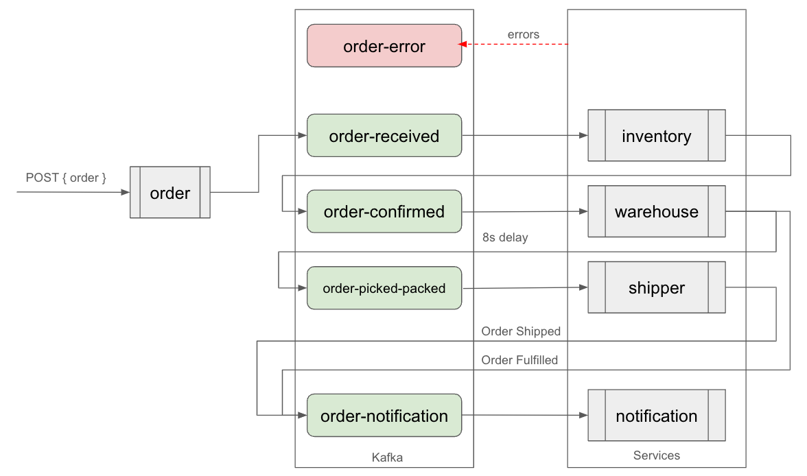

# Order Processing System

A distributed microservices system for processing orders using event-driven architecture with Kafka.

## System Architecture

The system consists of several microservices written in Go:

- **Order Service**: Handles order creation and management
- **Inventory Service**: Manages product inventory
- **Shipper Service**: Handles shipping logistics
- **Notification Service**: Sends notifications about order status
- **Warehouse Service**: Manages warehouse operations
- **Error Service**: Handles error tracking and monitoring

This diagram illustrates the general overview of how topics and services are connected.



### Event Flow

The system uses Kafka topics for event-driven communication:

- order-received
- order-confirmed
- order-picked-packed
- order-notification
- order-error

## Technologies Used

- **Language**: Go
- **Message Broker**: Apache Kafka
- **Containerization**: Docker
- **Configuration**: Environment variables using caarlos0/env
- **Monitoring**: Prometheus
- **API**: RESTful APIs using Gin framework

## Getting Started

### Prerequisites

- Docker and Docker Compose
- Go 1.23
- Kafka

### Setup

1. Clone the repository

2. Setup your environment in `scripts/.env`

```bash
COMPOSE_FILE=docker-compose.yml
PORT=29092
```

3. Start the environment

```bash
scripts/start-kafka.sh
```

Note that the environment is not persistent. The `start-kafka.sh` will execute `setup-env.sh` script to recreate the topics.

### Shutting down

1. Stopping the services

```bash
scripts/stop-kafka.sh
```

That is it!
